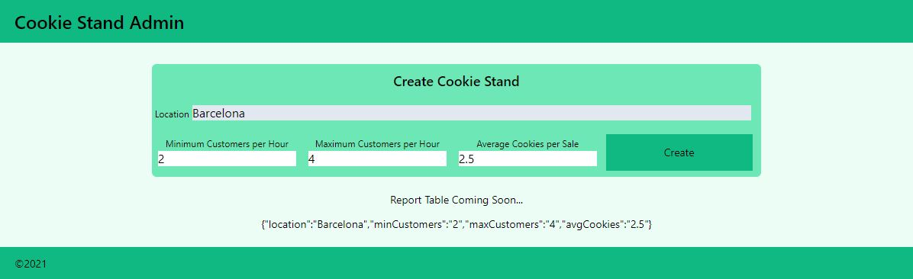

# Lab:37 - React I
## Author: Yu-Wei Hsieh

## Project Creation
- Create a project using the command line:
```npx create-next-app cookie-stand-admin```
- Go the project folder
- Execute ```npm run dev``` to start the app

## Image


## Source:
https://github.com/codefellows/seattle-code-python-401d19/tree/main/class-37
